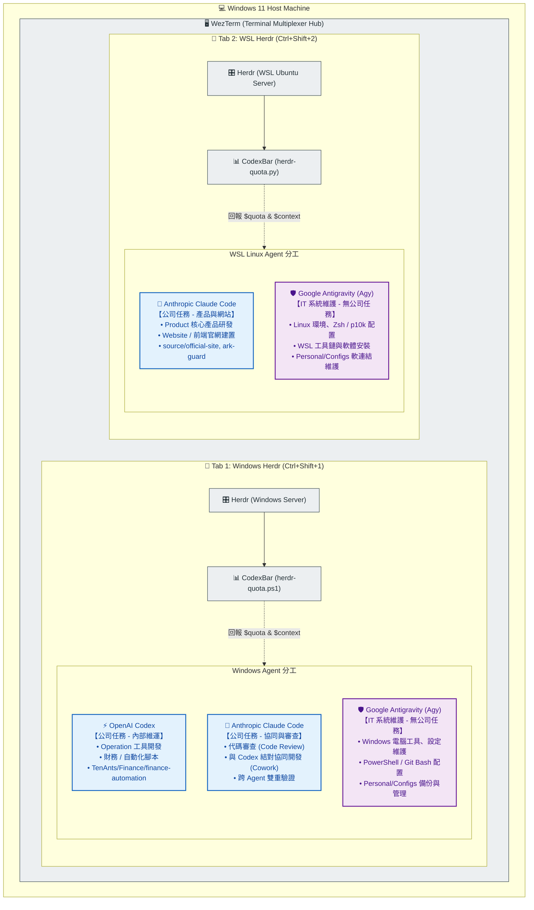

# Multi-Agent 工作環境架構規範 (Environment Architecture)

本文件定義並規範目前開發工作環境的系統架構、終端多工層、以及各家 AI Agent 的職責分工。  
**供未來任何接入本環境的 AI Agent 與人類工程師在調整設定、擴充工具或指派任務時遵循參考。**

---

## 1. 總體架構圖 (High-Level Architecture)

---

## 2. 核心架構原則 (Core Principles)

### 原則一：職責嚴格分離 (Strict Separation of Concerns)
* **公司業務任務 (Company Tasks)**：
  * **Windows 端**：由 **OpenAI Codex**（內部維運開發）與 **Anthropic Claude Code**（Code Review、與 Codex 結對協同開發）共同承接。
  * **WSL 端**：由 **Anthropic Claude Code**（產品核心研發與官網建置）承接。
  * 包含業務代碼編寫、審查、架構對話、商業自動化邏輯、產品網頁實作。
* **IT / 電腦設定維護 (IT & Infrastructure Tasks)**：
  * 統一由 **Google Antigravity (`agy`)** 擔任專屬 IT 助理。
  * **不承接公司業務代碼開發**，專門負責電腦環境工具鏈、dotfiles、PowerShell/Zsh 配置、WezTerm 設定、Herdr 調整、備份與系統自動化。
  * 避免業務專案的上下文與 IT 設定檔互相混雜污染。

### 原則二：雙環境分流與多工隔離 (Dual-Environment Multiplexing)
* **WezTerm 作為最外層分頁容器**：
  * 開機自動維持雙分頁結構：
    * `Tab 1` (<kbd>Ctrl+Shift+1</kbd>)：**Windows 原生環境**（掛載 Windows Herdr，運行 Codex、Claude、Agy）。
    * `Tab 2` (<kbd>Ctrl+Shift+2</kbd>)：**WSL 2 (Ubuntu) 環境**（掛載 WSL Herdr，運行 Claude、Agy）。
* **Herdr 作為各環境內部的 Agent 工作區管理器**：
  * 各環境各自啟動獨立的 `herdr` background server。
  * 支援任意垂直（`Ctrl+a |`）或水平（`Ctrl+a -`）分割 Pane，讓多位 Agent 在各自專案目錄下並行運作。
  * 支援 Shell 整合（OSC 9;9 Live CWD），當工程師或 Agent `cd` 切換專案時，Herdr 工作區目錄即時連動。

### 原則三：即時資源與上下文感測 (Resource & Context Observability)
* 透過自研的 **CodexBar** 工具整合：
  * **Windows**：`herdr/windows/scripts/herdr-quota.ps1` 同步監控 Codex、Claude 與 Agy。
  * **WSL**：`herdr/wsl/scripts/herdr-quota.py` 監控 Claude Code 與 Agy。
* **指標透明化**：
  * **Quota**：即時回報 5 小時動態視窗剩餘 % 與倒數計時。
  * **Context**：自動解析各 Agent 的 Session Log（`transcript_full.jsonl`、`rollout-*.jsonl`、`~/.claude/projects/*/*.jsonl`），回報當前對話消耗之 Token 數與佔比。
  * **展示端點**：Herdr 頂部狀態列、Herdr 側邊欄 Agent 卡片（`$quota $context`）、以及全螢幕彈出儀表板（`Ctrl+a q`）。

---

## 3. Agent 角色矩陣與目錄邊界 (Agent Role Matrix & Directory Boundaries)

| Agent 名稱 | 所屬環境 | 供應商 / 模型 | 角色定位 | 任務範圍 (Scope) | 主要工作路徑範例 |
| :--- | :--- | :--- | :--- | :--- | :--- |
| **OpenAI Codex** | Windows | OpenAI (Codex / GPT) | **業務維運工程師** | 公司任務：內部 Operations 工具、財務自動化、資料處理系統 | `C:\Users\cyc76\Documents\TenAnts\Finance\...` |
| **Anthropic Claude** | Windows | Anthropic (Claude Code / Sonnet) | **審查與協同工程師** | 公司任務：代碼審查 (Code Review)、與 Codex 協同開發 (Cowork) | 依 Codex 工作專案路徑而定 |
| **Anthropic Claude** | WSL | Anthropic (Claude Code / Sonnet) | **業務產品工程師** | 公司任務：對外核心 Product、官網、Web 前端/後端架構 | `/home/james/source/official-site/` `/home/james/source/ark-guard/` |
| **Google Antigravity** | Windows | Google (Agy / Gemini) | **Windows IT 系統管理員** | IT 維護：Windows 終端機設定、PowerShell Profile、dotfiles 備份 | `C:\Users\cyc76\Documents\Personal\Configs` |
| **Google Antigravity** | WSL | Google (Agy / Gemini) | **Linux IT 系統管理員** | IT 維護：WSL Linux 環境套件、Zsh/p10k、軟連結維護與自動化 | `/home/james/.config/herdr/` `/home/james/Personal/Configs` |

---

## 4. 給未來 Agent 的操作守則 (Guidelines for Future Agents)

當您（AI Agent）接入此工作環境並被指派工作時，請遵循以下步驟：

1. **辨識自身職責**：
   * 如果您是 **Agy (Antigravity)**：您的任務專注於 **IT 設定、工具維護、設定檔撰寫、除錯電腦環境**。若使用者詢問公司業務系統，提醒應由 Windows Codex 或 WSL Claude 接手。
   * 如果您是 **Codex**：專注於 **公司 Operations / Finance 工具開發**，請勿擅自改動使用者的系統 dotfiles。
   * 如果您是 **Claude**：在 Windows 端專注於 **代碼審查 (Code Review) 與 Codex 結對協同 (Cowork)**；在 WSL 端專注於 **公司核心 Product / Website 開發**。
2. **遵守跨 Agent 協作規範 (Multi-Agent via Herdr)**：
   * 若需分工協同（例如 Agy 做 IT 環境配置，Codex 做功能實作），可利用 Herdr API 進行跨視窗調度：
     * `herdr agent list`：查看當前運作中的其他 Agent。
     * `herdr agent prompt <TARGET> "<PROMPT>"`：指派任務給其他視窗的 Agent。
     * `herdr agent wait <TARGET>`：等待對手 Agent 完成。
     * `herdr agent read <TARGET>`：擷取其他 Agent 的成果進行接力。
3. **留意 Context 與 Quota 資源限制**：
   * 隨時可執行 `codexbar` 或 `codexbar ctx` 查看當前 Session 消耗的 Token 量與 5h 額度，避免無意義的大量重複輸出消耗 Context Window。
